# Netflix Data Analysis & Visualization

Welcome to the **Netflix Data Analysis & Visualization** project! This project explores the rich dataset of Netflix content, uncovering trends, patterns, and insights through interactive and static visualizations.

We delve into various aspects like content type, country of production, popular actors, genres, and temporal trends in content uploads to answer questions like:
- What type of content dominates Netflix?
- Which countries are leading in production?
- How has the content evolved over the years?
- What genres and actors are most popular?

---

## 🌟 Key Insights

- 📈 **Total Records:** 8807 entries, spanning Movies and TV Shows.
- 🎬 **Content Types:** Movies dominate over TV Shows.
- 🌍 **Global Presence:** Titles span across multiple countries, but a few dominate.
- 👨‍🎤 **Popular Cast Members:** Some actors feature significantly more than others.
- 📅 **Yearly Upload Trends:** Drastic growth after 2014, peaking in recent years.
- 📌 **Genres & Ratings:** Certain genres and ratings are highly frequent.
- 🗓️ **Time-based Trends:** Clear seasonal and quarterly patterns in uploads.

---

## 🧾 Dataset

- **Source:** Netflix dataset from [Kaggle Netflix Dataset](https://www.kaggle.com/datasets/shivamb/netflix-shows)

---

## 🛠️ Tools & Libraries Used

- **Python**
- **Pandas, NumPy** – data manipulation
- **Matplotlib, Seaborn** – plotting & visualization
- **WordCloud** – text data visualization
- **Jupyter Notebook** – analysis environment

---

## 📉 Visualizations & Inferences

### 1. 📺 Netflix Content Breakdown: Movies vs TV Shows
> Visualizes the distribution of movies and TV shows. Majority of the content is **Movies**.

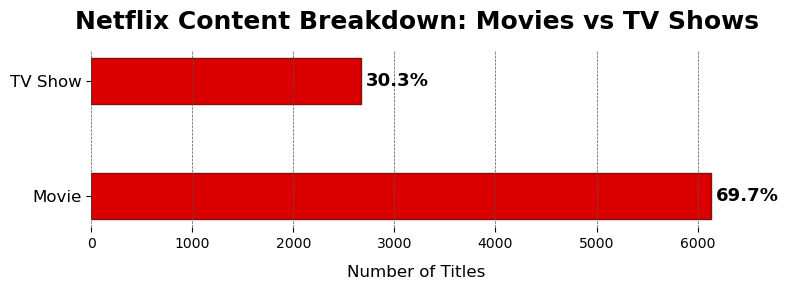

---

### 2. 📆 Content Added to Netflix by Year
> Shows the number of titles added each year, highlighting a massive surge post-2014.

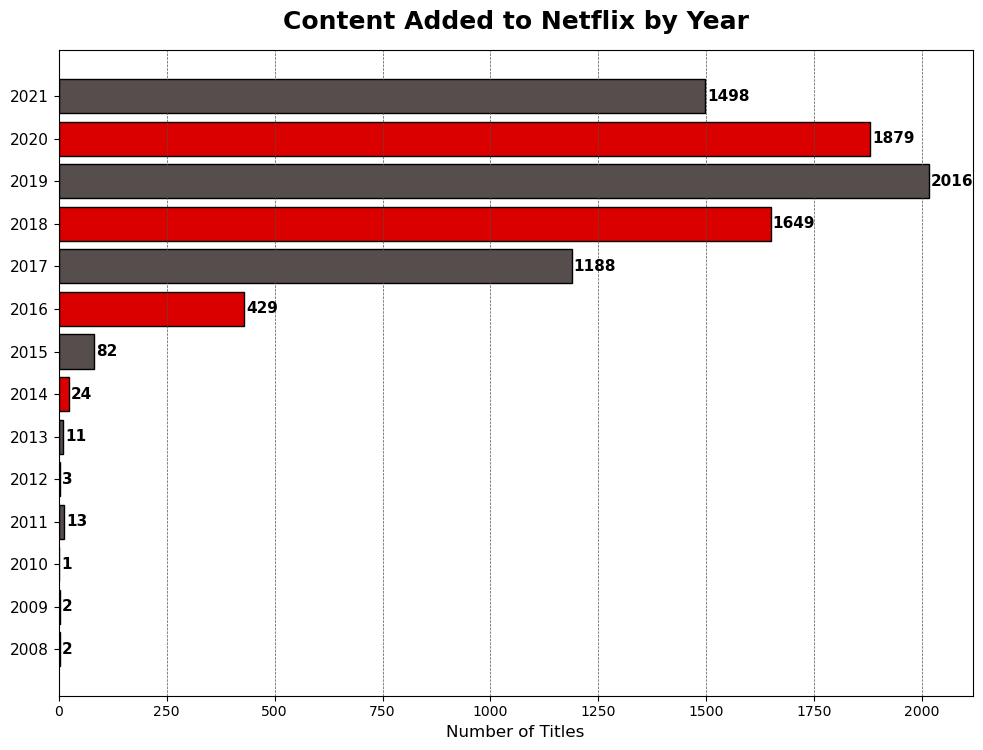

---

### 3. 🚀 Netflix Content Growth Over Years
> A line+bar chart showing Netflix’s exponential growth over the years.

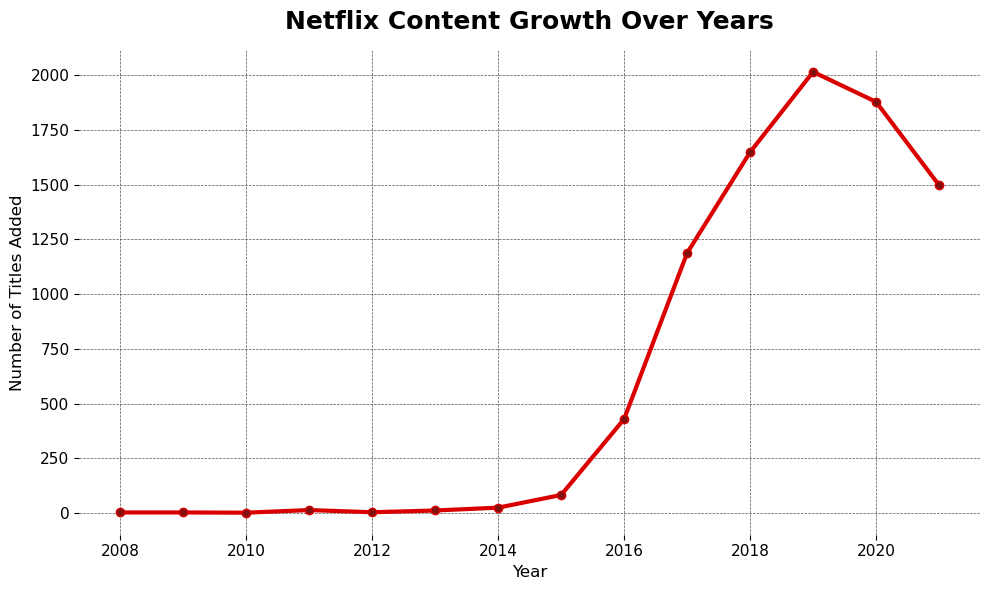

---

### 4. 🌍 Top 10 Countries with Most Netflix Titles
> Reveals countries with the highest number of titles. **USA** leads, followed by **India**.

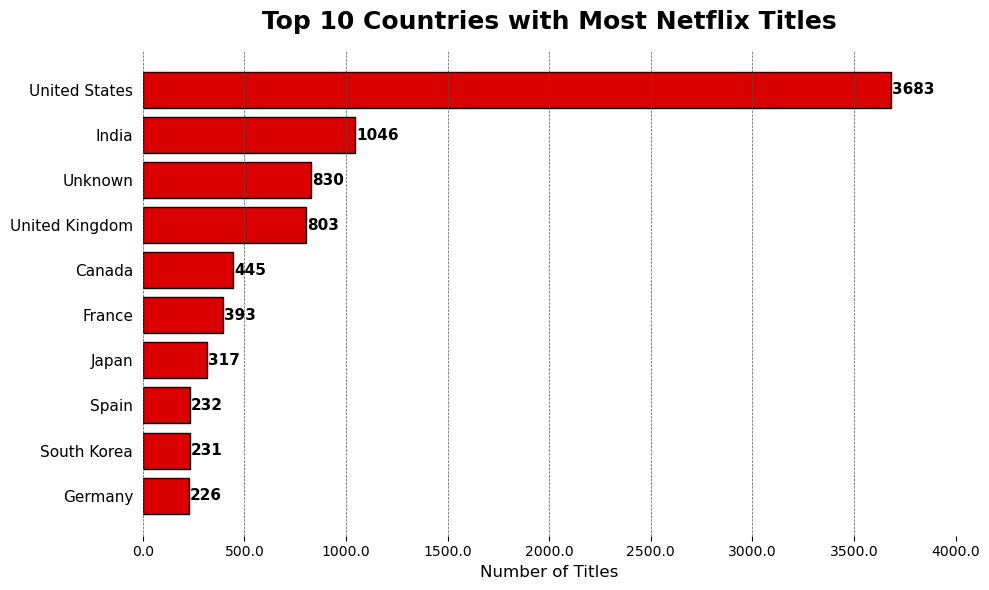

---

### 5. 🎫 Top 10 Most Common Ratings on Netflix
> Highlights the most frequently assigned content ratings.

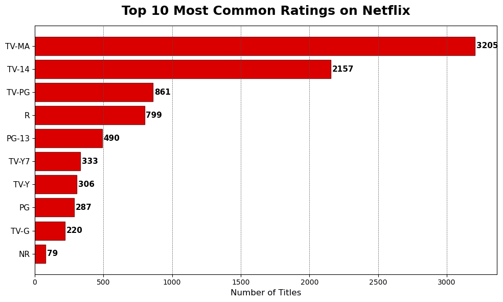

---

### 6. ⚖️ Distribution of Ratings by Content Type
> Shows how content ratings vary between Movies and TV Shows.

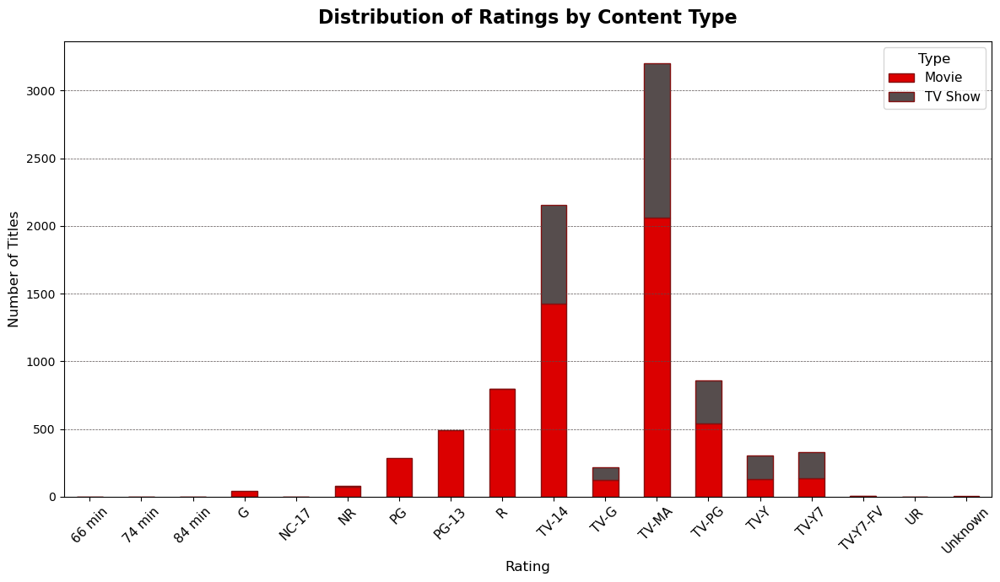

---

### 7. 🧬 Top 10 Most Common Netflix Genres
> Popular genres in Netflix’s catalog. **Dramas**, **Comedies**, and **Documentaries** dominate.

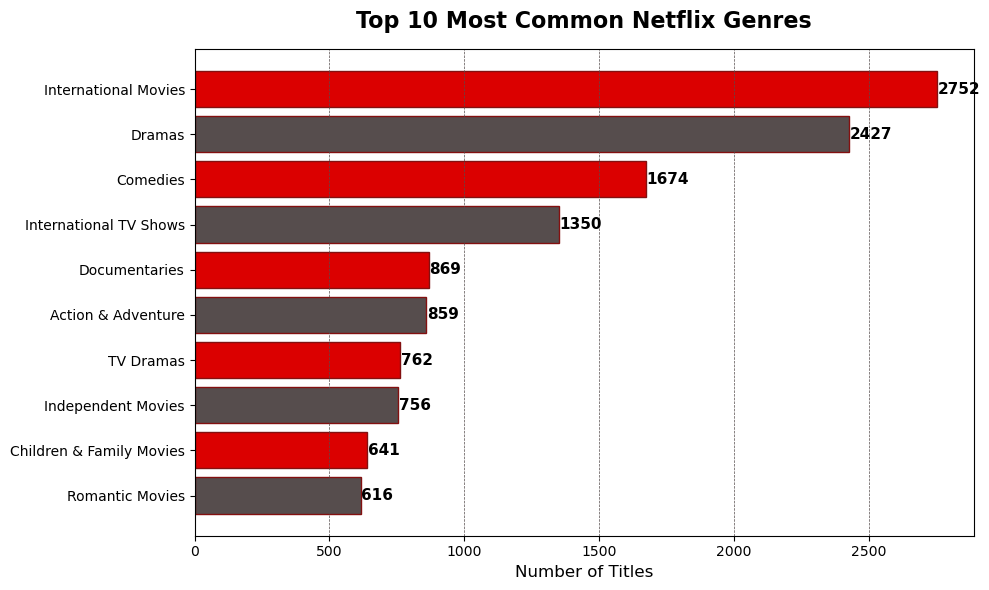

---

### 8. 📈 Netflix Upload Trend (Quarterly)
> Timeline showing Netflix's quarterly uploads and their trend.

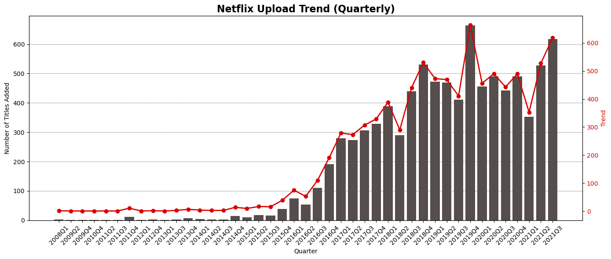

---

### 9. 👥 Top 10 Most Frequent Actors on Netflix
> Actors with the most appearances in Netflix titles.

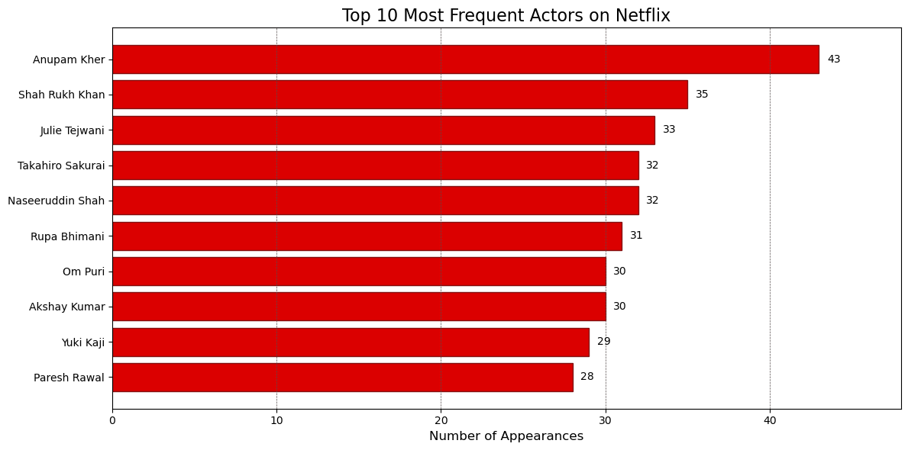

---

### 10. 🕰️ Genre Popularity Over Time on Netflix
> Line plot showing how different genres gained or lost popularity over the years.

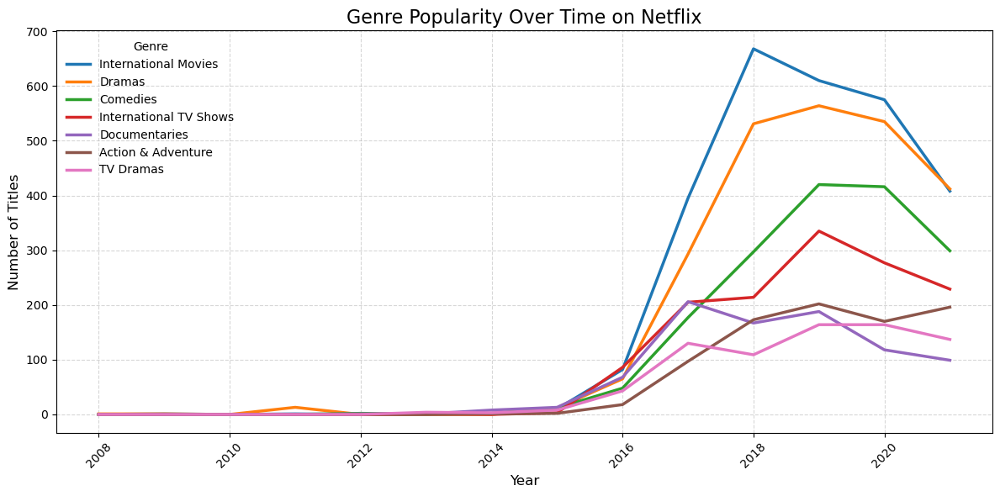

---

### 11. 🔥 Netflix Content Uploads by Month and Year (2014 onwards)
> Heatmap showing when content was most actively uploaded, starting from 2014.

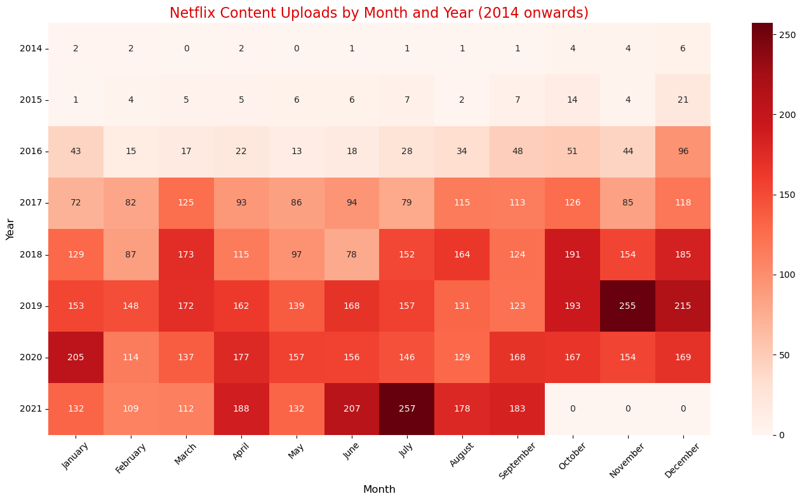

---

### 12. ☁️ Word Cloud of Netflix Content Descriptions
> Common words in content descriptions, giving a glimpse into prevalent themes.

---

## 🤝 Let's Connect

Feel free to connect with me on:

- [LinkedIn](https://www.linkedin.com/in/raj-tejaswee-147603247/)
- [Twitter](https://x.com/raj_tejaswee)

If you liked this project, consider giving it a ⭐️!

---

> *Made with Python & Data Visualization*

